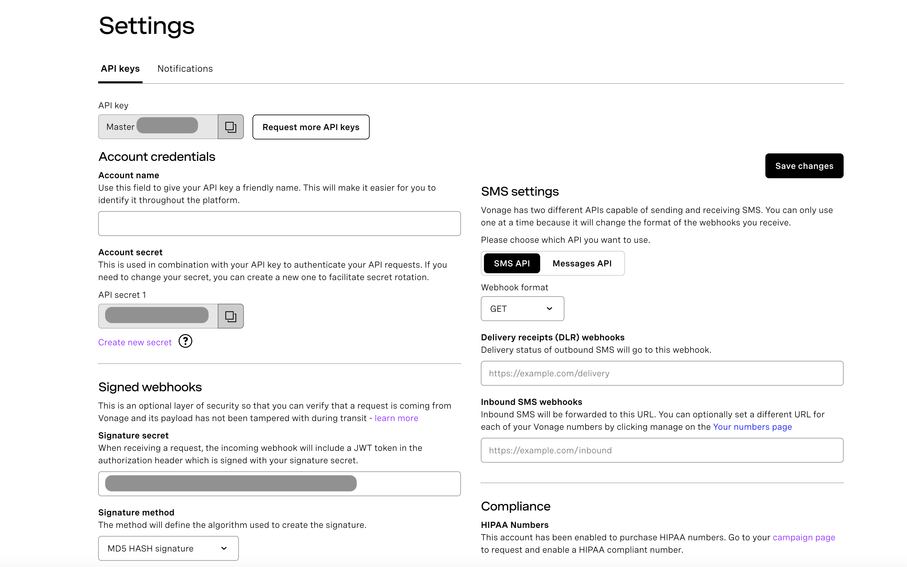
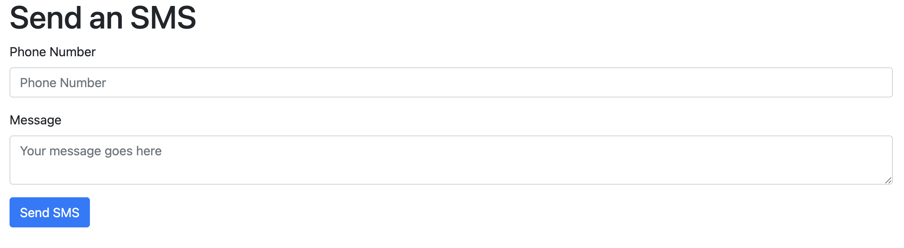

# How to Send SMS Messages with Python, Flask, and Vonage

Using content in this repository, you can send an SMS using the Flask application and Vonage API. Prepared a simple code sample will be an excellent point to start and create your application quickly. 

## Requirements

* [Python](https://www.python.org/downloads/)
* [GIT](https://git-scm.com/downloads)
* [Vonage Application](https://developer.vonage.com/application/overview)

Sign in/Sign up for free [developer.vonage.com](https://developer.vonage.com/); to be able to use the [Vonage Messages API](https://developer.vonage.com/en/messages/overview), you'll have to create a [Vonage Application](https://developer.vonage.com/application/overview) from the developer portal.



In the left menu [here](https://dashboard.nexmo.com/), click API Settings. Under the API keys tab, you will find your API key and Account secret (API secret). We will use these credentials later.

**Set up a Python**

First, make sure that your laptop/server has [Python 3](https://www.python.org/downloads/) installed. We will then use venv to create an isolated environment with only the necessary packages.

To deploy the application, you need to clone the repo using [git](https://git-scm.com/downloads) and update `.env` with your credentials

## Installation

Clone source code
```bash
git clone https://github.com/obvonage/tutorial-sms-flask-python-sdk 
```

Go to the project folder
```bash
cd tutorial-sms-flask-python-sdk
```

Install dependencies 

```bash
pip install -r requirements.txt
```

Start your app with the following command.

```bash
FLASK_APP=server.py flask run
```
Expected output
```bash
 * Serving Flask app 'server.py'
 * Debug mode: on
WARNING: This is a development server. Do not use it in a production deployment. Use a production WSGI server instead.
 * Running on http://127.0.0.1:5000
Press CTRL+C to quit
 * Restarting with stat
 * Debugger is active!
 * Debugger PIN: 648-303-150

```
## Usage

Open [http://localhost:5000/](http://localhost:5000/) in your browser, and you should see the following web page



Let's send an SMS using this interface. Ensure the number is in international format without the '+' at the start. Hit "Send SMS" and check your phone!
